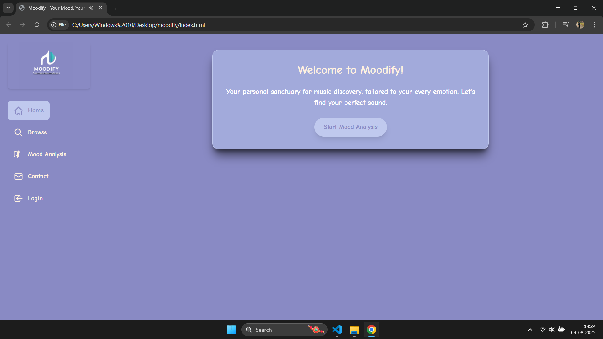
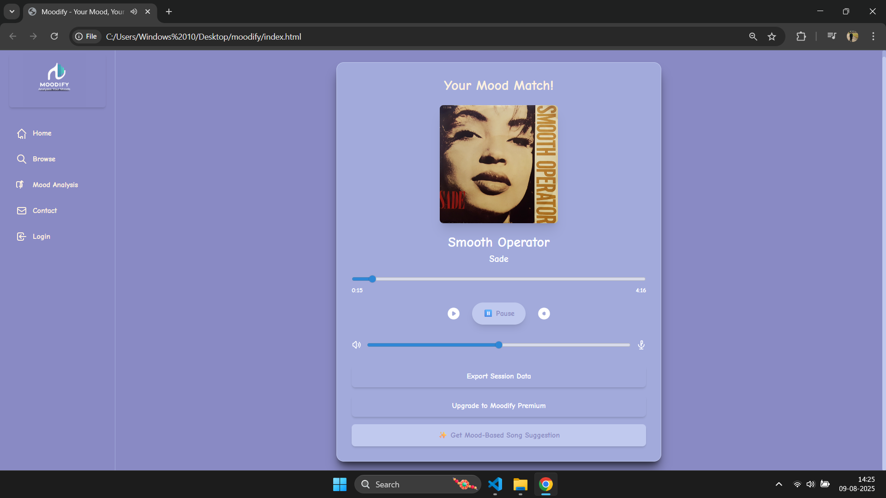
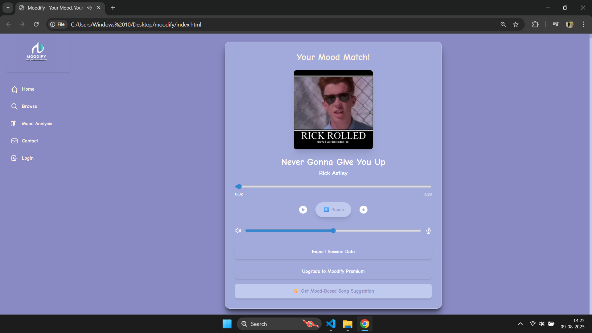
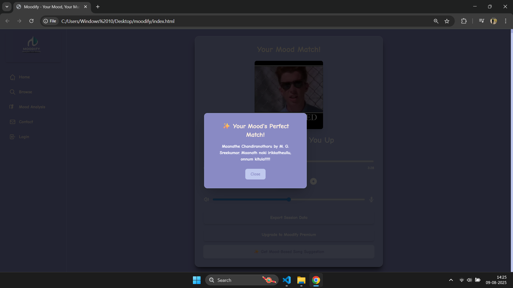
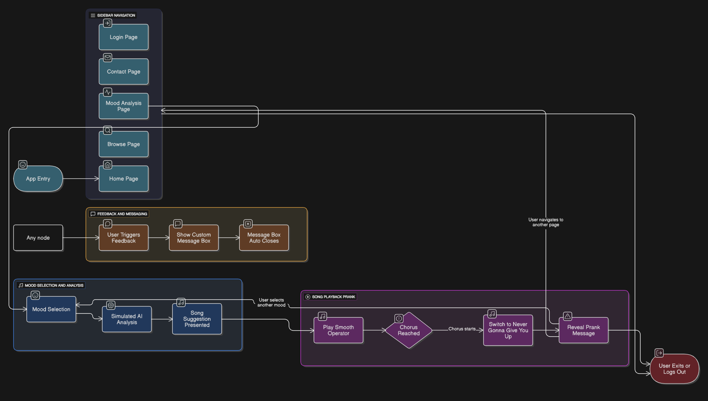

# MOODIFY 🎯

## Basic Details
### Team Name: N-Duo

### Team Members
- Team Lead: NAVDHA VASANTH - COLLEGE OF ENGINEERING, THALASSERY
- Member 2: NATHASHA VIPIN - COLLEGE OF ENGINEERING, THALASSERY

### Project Description
->What it is: Moodify is a fun and playful website that looks like a serious music player.

->Main Goal: It's designed to surprise and make you laugh by pretending to understand your mood and playing the perfect song, with a twist!

->Look & Feel: It uses a cool, friendly font called Comic Neue and a calming set of blue and lavender colors to make it look unique.

### The Problem (that doesn't exist)
->Boring Music Apps: Sometimes, regular music players can feel a bit dull and don't connect with how you're feeling.

->No Surprises: Most apps just play music; they don't offer anything unexpected or funny to brighten your day.

->Missing Personality: There's a need for apps that have a bit more character and can bring a smile to your face.

### The Solution (that nobody asked for)
->Mood Picker: You tell Moodify how you're feeling by clicking simple buttons. This makes it feel like the app really cares about your mood.

->"Smart AI" Fun: The app pretends to use AI to pick a song for you, giving you a funny, over-the-top description of why it's the perfect match.

->The Prank! The best part is the surprise: it starts with a smooth song, but then suddenly switches to a famous, unexpected tune, which is a classic internet prank!

->Easy Navigation: It's built like a mini-website with a menu on the side (like "Home," "Browse," "Contact," etc.) so it feels organized and easy to use.

->Clear Messages: All messages (like confirmations or funny notes) pop up in a neat box that closes by itself or when you click "Close."

## Technical Details
### Technologies/Components Used
Languages Used:

->HTML: The basic structure of the website.

->CSS: Makes the website look good (colors, fonts, layout).

->JavaScript: Makes everything interactive (buttons work, music plays, AI "thinks").

Tools & Libraries:

->Tailwind CSS: Helps style the website quickly and neatly.

->Google Fonts: Used to get the cool Comic Neue font.

->HTML Audio API: Controls the music playback right in your browser.

No Backend: This app runs entirely in your web browser. It doesn't save your information on a server or connect to complex online systems. It's all about the fun happening right on your screen!

# Screenshots (Add at least 3)

# Diagrams

## Team Contributions
- Nathasha Vipin: Frontend development
- Navdha Vasanth: Idea and UML Design

---
Made with ❤️ at TinkerHub Useless Projects 

